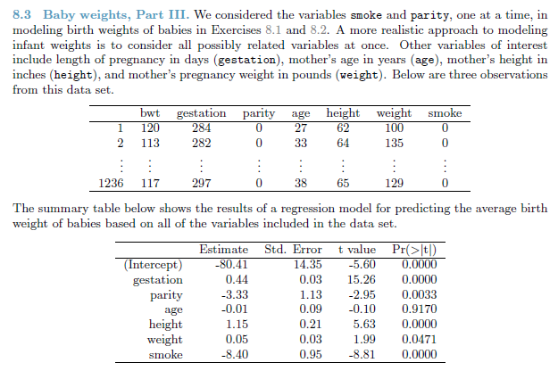
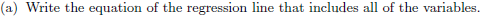
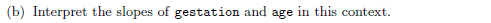
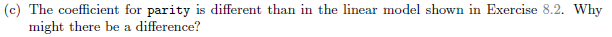
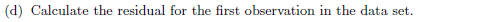
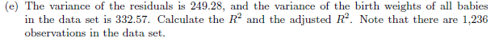

```{r setup, include=FALSE}
knitr::opts_chunk$set(echo = TRUE)
```

#Question



#Read data

```{r read-data, eval=TRUE}
url <- "https://raw.githubusercontent.com/jbryer/DATA606Fall2016/master/Data/Data%20from%20openintro.org/Ch%208%20Exercise%20Data/babies.csv"
babies <- read.csv(url)

```

#



The equation of the regression line is:

$$\hat{bwt} = -80.41 + 0.44 * gestation - 3.33 * parity - 0.01 * age + 1.15 * height + 0.05 * weight - 8.40 * smoke$$

#



Gestation has a positive relationship with the baby's birth weight.  A value of 0.44 means that it is predicted that there will be a 0.44 ounce increase in baby weight for each additional day the baby gestates.

Conversely, age has a negative relationship with the baby's birth weight.   A value of 0.01 means that it is predicted that there will be a decrease in birth weight of 0.01 ounce as the mother's age increases by one year.


# 


In exercise 8.2, the coefficient for parity was -1.93.
In this exercise, the coefficient is -3.33.

This can be explained by the presence of the correlation between parity and one of the other variables examined in this exercise.  

#


The residual can be calculated as follows:

```{r first-residual, eval=TRUE}
predict1 <- -80.41 + 0.44 * babies$gestation[1] -3.33 * babies$parity[1] - 0.01 * babies$age[1] + 1.15 * babies$height[1] + 0.05 * babies$weight[1] - 8.40 * babies$smoke[1]

residual1 <- babies$bwt[1] - predict1

```

The prediction for the first observation is `r predict1`.  The actual value is `r babies$bwt[1]`.  Therefore the residual is `r residual1`. 


#



```{r r2-r2adj, eval=TRUE}
size <- nrow(babies)
VarTotal <- 332.57
VarError <- 249.28
#Var = SS/Size-1.  Therefore SS = Var * (size - 1)
SSTotal <- VarTotal * size -1
SSError <- VarError * size -1


Rsquared <- (SSTotal - SSError)/SSTotal

Rsquaredadj <- 1 - ((SSError/SSTotal) * ((size -1)/(size - 6 - 1)))

```

$R^{2}$ = `r round(Rsquared,4)` 

$R^{2}_{adj}$ = `r round(Rsquaredadj, 4)`


